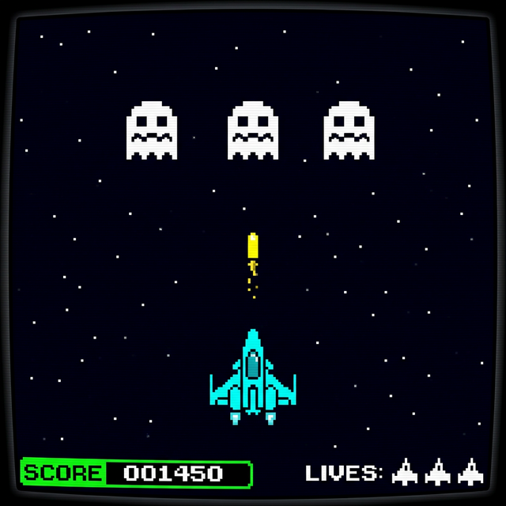

# 🚀 Space Fight — FPGA Space Invaders on DE2-115

> An 8-bit Space Invaders–style arcade game implemented entirely in Verilog and displayed over VGA, running on an Altera Cyclone II FPGA (DE2 board).

---

## 🎬 Demo Video

https://github.com/Navnofficial/Space_Fighter-FPGA/assets/Space_Fighter.mp4

> If the video doesn't auto-play above, [click here to download/view it](assets/Space_Fighter.mp4).

---

## 📸 Screenshots

### 🎮 Gameplay


### 🔌 Hardware Setup


---

## 🏗️ Architecture Diagram


---

## 📺 Demo

| Feature | Details |
|---------|---------|
| **Resolution** | 640 × 480 @ 60 Hz |
| **System Clock** | 50 MHz (Cyclone II) |
| **Pixel Clock** | 25 MHz (divided from system clock) |
| **Tool** | Quartus II 13.0 SP1 |
| **Device** | EP2C35F672C6 (Cyclone II) |
| **Top Module** | `space_fight` |

---

## 🎮 Controls

| Button | Action |
|--------|--------|
| `KEY3` | Move player **Left** |
| `KEY2` | Move player **Right** |
| `KEY1` | **Shoot** bullet |
| `KEY0` | **Reset** game |

---

## 🕹️ Gameplay

- **Player ship** moves horizontally at the bottom of the screen
- **3 enemy ghost ships** descend in formation, reversing direction at edges (Space Invaders style)
- **Shoot** enemies to score points — the score bar grows with each kill
- **3 Lives** displayed as mini ship icons in the HUD
- Destroy all 3 enemies to win → **"YOU WIN"** banner appears
- Let enemies reach the player row → lose a life; lose all 3 → **"GAME OVER"** banner appears
- A **starfield background** of 32 fixed stars fills the space backdrop

---

## 🏗️ Architecture / Module Breakdown

```
space_fight.v
│
├── 1. Pixel Clock Generation       — 25 MHz derived from 50 MHz CLOCK_50
├── 2. VGA Timing Controller        — H/V counters, sync signals, blanking
├── 3. Frame Tick Generator         — ~60 Hz game-logic clock tick
├── 4. Button Debounce + Shoot Latch — Reliable edge detection on KEY1–KEY3
├── 5. Game Constants               — Speed, size, and layout parameters
├── 6. Game Registers               — Player, bullet, 3 enemies, score, lives
├── 7. Sprite ROMs (functions)      — 16×16 ship, 16×12 ghost, 8×7 life icon
├── 8. Starfield                    — 32 fixed star positions
├── 9. Game Logic                   — Movement, collision, win/loss FSM
├── 10. Pixel Rendering             — Sprite bounding-box + bitmap lookup
├── 11. Text Font                   — 5×7 pixel font (GAME OVER / YOU WIN)
├── 12. Banner Rendering            — Centered message overlays
└── 13. Colour Mixer                — Priority-based RGB output
```

---

## 📐 Pin Assignments (DE2 / Cyclone II EP2C35F672C6)

| Signal | Pin |
|--------|-----|
| `CLOCK_50` | PIN_N2 |
| `KEY0` (Reset) | PIN_G26 |
| `KEY1` (Shoot) | PIN_N23 |
| `KEY2` (Right) | PIN_P23 |
| `KEY3` (Left) | PIN_W26 |
| `VGA_HS` | PIN_A7 |
| `VGA_VS` | PIN_D8 |
| `VGA_BLANK_N` | PIN_D6 |
| `VGA_SYNC_N` | PIN_B7 |
| `VGA_CLK` | PIN_B8 |
| `VGA_R[7:0]` | PIN_H12 … PIN_C8 |
| `VGA_G[7:0]` | PIN_D11 … PIN_B9 |
| `VGA_B[7:0]` | PIN_B11 … PIN_J13 |

Full pin assignments are in [`space_fight.qsf`](space_fight.qsf).

---

## 🛠️ How to Build & Program

### Requirements
- [Intel/Altera Quartus II 13.0 SP1](https://www.intel.com/content/www/us/en/software-kit/legacy.html) (Web Edition works)
- DE2 FPGA board (Cyclone II EP2C35F672C6) or compatible
- USB-Blaster programmer cable
- VGA monitor

### Steps

```bash
# 1. Open the project in Quartus II
File → Open Project → space_fight.qpf

# 2. Compile
Processing → Start Compilation   (or Ctrl+L)

# 3. Program the FPGA
Tools → Programmer → Add File → output_files/space_fight.sof
Click "Start"

# 4. Connect a VGA monitor and play!
```

---

## 🎨 Colour Palette

| Object | Colour |
|--------|--------|
| Player ship | `#00FFFF` (Cyan) |
| Enemy ghosts | `#FFFFFF` (White) |
| Bullet | `#FFFF00` (Yellow) |
| Score bar | `#00FF00` (Green) |
| Lives | `#FFFFFF` (White) |
| Stars | `#AAAAAA` (Grey) |
| Background | `#000005` (Near-black blue) |
| GAME OVER banner | `#CC0000` (Red) with white text |
| YOU WIN banner | `#00AA00` (Green) with white text |

---

## 📁 File Structure

```
space_fight/
├── space_fight.v        # Top-level Verilog source (all logic in one file)
├── space_fight.qpf      # Quartus Project File
├── space_fight.qsf      # Quartus Settings File (pin assignments, device)
├── assets/              # Screenshots and demo media for README
│   ├── gameplay.png
│   ├── gameover.png
│   ├── architecture.png
│   └── demo.mp4         # (add your own gameplay recording here)
├── output_files/        # Compiled bitstream (.sof, .pof, reports)
└── db/ incremental_db/  # Quartus internal databases (gitignored)
```

---

## 📜 License

This project is released under the [MIT License](LICENSE).

---

## 👤 Author

Made with ❤️ and logic gates.  
Feel free to fork, extend with more enemy waves, scrolling backgrounds, or sound output!
