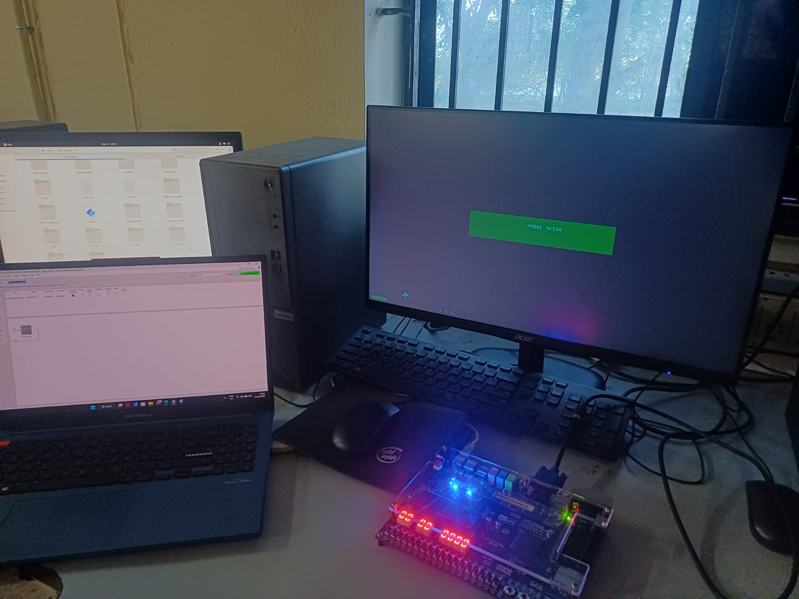
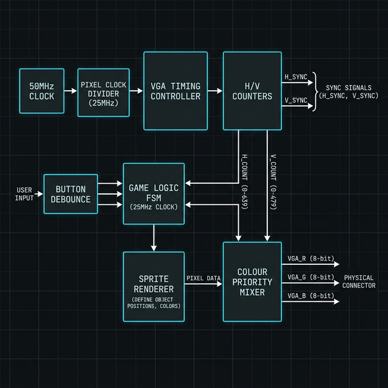

# Space Fighter — FPGA VGA Arcade Game

An 8-bit Space Invaders-style arcade game implemented entirely in Verilog, rendered over a 640x480 VGA display at 60 Hz, targeting the Altera DE2 board (Cyclone II EP2C35F672C6).

---

## Demo Video

https://github.com/user-attachments/assets/3547e2ed-9ec8-4107-8ad0-6e2898680d86

---

## Setup

### Hardware Setup



### Architecture Diagram



---

## Project Overview

| Property | Value |
|----------|-------|
| Resolution | 640 x 480 @ 60 Hz |
| System Clock | 50 MHz |
| Pixel Clock | 25 MHz (clock-enabled toggle) |
| FPGA Family | Cyclone II |
| Device | EP2C35F672C6 |
| EDA Tool | Quartus II 13.0 SP1 |
| Top-Level Module | `space_fight` |
| Language | Verilog HDL |

---

## Controls

| Button | Action |
|--------|--------|
| KEY3 | Move player left |
| KEY2 | Move player right |
| KEY1 | Fire bullet |
| KEY0 | Reset game |

---

## Gameplay

- The player ship moves horizontally along the bottom of the screen.
- Three enemy ships descend in formation, reversing direction at screen edges — similar to classic Space Invaders.
- Shooting an enemy increments the score bar displayed at the bottom.
- The player has 3 lives, shown as mini ship icons in the HUD.
- Destroying all 3 enemies triggers a **YOU WIN** banner.
- Allowing enemies to reach the player row costs a life. Losing all 3 triggers a **GAME OVER** banner.
- 32 fixed star positions form the background starfield.

---

## Module Architecture

```
space_fight.v
|
+-- 1.  Pixel Clock Generation        25 MHz derived from 50 MHz CLOCK_50
+-- 2.  VGA Timing Controller         H/V counters, sync signals, blanking
+-- 3.  Frame Tick Generator          ~60 Hz game-logic clock tick
+-- 4.  Button Debounce + Shoot Latch Reliable edge detection on KEY1-KEY3
+-- 5.  Game Constants                Speed, size, and layout parameters
+-- 6.  Game State Registers          Player, bullet, 3 enemies, score, lives
+-- 7.  Sprite ROMs (functions)       16x16 ship, 16x12 ghost, 8x7 life icon
+-- 8.  Starfield                     32 fixed star coordinates
+-- 9.  Game Logic FSM                Movement, collision, win/loss conditions
+-- 10. Pixel Rendering               Sprite bounding-box and bitmap lookup
+-- 11. Text Font ROM                 5x7 pixel font for GAME OVER / YOU WIN
+-- 12. Banner Rendering              Centered message overlays
+-- 13. Colour Priority Mixer         Priority-based RGB output assignment
```

---

## Pin Assignments

| Signal | Pin |
|--------|-----|
| CLOCK_50 | PIN_N2 |
| KEY0 (Reset) | PIN_G26 |
| KEY1 (Shoot) | PIN_N23 |
| KEY2 (Right) | PIN_P23 |
| KEY3 (Left) | PIN_W26 |
| VGA_HS | PIN_A7 |
| VGA_VS | PIN_D8 |
| VGA_BLANK_N | PIN_D6 |
| VGA_SYNC_N | PIN_B7 |
| VGA_CLK | PIN_B8 |
| VGA_R[7:0] | PIN_H12 to PIN_C8 |
| VGA_G[7:0] | PIN_D11 to PIN_B9 |
| VGA_B[7:0] | PIN_B11 to PIN_J13 |

Full pin assignments are defined in [space_fight.qsf](space_fight.qsf).

---

## Colour Palette

| Element | Hex Colour |
|---------|-----------|
| Player ship | `#00FFFF` |
| Enemy sprites | `#FFFFFF` |
| Bullet | `#FFFF00` |
| Score bar | `#00FF00` |
| Life icons | `#FFFFFF` |
| Stars | `#AAAAAA` |
| Background | `#000005` |
| Game Over banner | `#CC0000` |
| You Win banner | `#00AA00` |

---

## Build and Program

### Requirements

- Quartus II 13.0 SP1 (Web Edition)
- DE2 FPGA board with Cyclone II EP2C35F672C6
- USB-Blaster programmer
- VGA monitor

### Steps

```
1. Open project:  File > Open Project > space_fight.qpf
2. Compile:       Processing > Start Compilation  (Ctrl+L)
3. Program FPGA:  Tools > Programmer > Add File > output_files/space_fight.sof > Start
4. Connect VGA monitor and press KEY0 to start.
```

---

## File Structure

```
space_fight/
+-- space_fight.v          Top-level Verilog source
+-- space_fight.qpf        Quartus project file
+-- space_fight.qsf        Quartus settings file (pin assignments, device)
+-- assets/
|   +-- Space_Fighter.mp4  Gameplay recording
|   +-- Setup_1.png        Hardware setup photo
|   +-- architecture.png   System block diagram
+-- output_files/          Compiled bitstream (.sof, .pof) and reports
+-- db/                    Quartus internal database (gitignored)
+-- incremental_db/        Quartus incremental database (gitignored)
```

---

## License

This project is released under the [MIT License](LICENSE).
